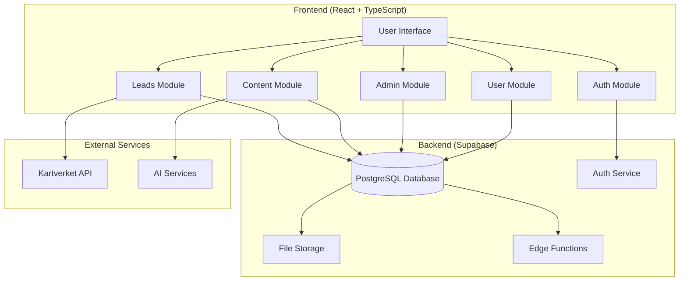
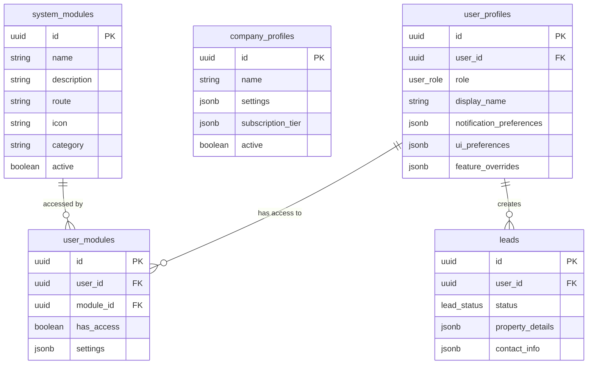
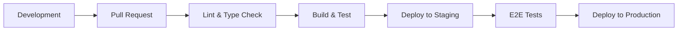

# Homni Platform Architecture

## Overview

Homni follows a **modular service architecture** built on modern React and Supabase foundations. The system emphasizes role-based access control, feature modularity, and comprehensive testing.

## Core Architectural Principles

### 1. Modular Design
- **Feature Modules**: Each major capability (auth, leads, content, etc.) is encapsulated in its own module
- **Shared Components**: Common UI elements and utilities are centralized to avoid duplication
- **Plugin Architecture**: Modules can be enabled/disabled via feature flags and user access controls

### 2. Role-Based Access Control (RBAC)
- **Six Core Roles**: `guest`, `user`, `company`, `content_editor`, `admin`, `master_admin`
- **Granular Permissions**: Module-level and feature-level access control
- **Database-Enforced**: All security policies implemented at the database level via RLS

### 3. Data-Driven Configuration
- **Route Objects**: No JSX `<Route>` elements, all routing defined as data structures
- **Navigation Config**: Menu items and navigation determined by role-based configuration
- **Feature Flags**: Runtime control over feature availability and rollout

## System Architecture



## Module Structure

Each module follows a standardized structure:

```
src/modules/[module-name]/
  /api/         - API functions and data fetching
  /components/  - React components specific to this module
  /hooks/       - Custom React hooks for module logic
  /pages/       - Route pages and main module entry points
  /types/       - TypeScript type definitions
  /utils/       - Utility functions and helpers
  /__tests__/   - Unit and integration tests
  README.md     - Module documentation
```

### Core Modules

#### 1. Auth Module (`src/modules/auth/`)
- **Purpose**: User authentication, registration, and role management
- **Key Features**: 
  - QuickLogin (passwordless authentication)
  - Role-based access control
  - Company membership management
  - Profile management

#### 2. Leads Module (`src/modules/leads/`)
- **Purpose**: Lead generation, processing, and distribution
- **Key Features**:
  - Lead capture and validation
  - Automated distribution strategies
  - Kanban-style lead pipeline
  - Company-specific lead management

#### 3. Content Module (`src/modules/content/`)
- **Purpose**: Content management system for articles and pages
- **Key Features**:
  - Article creation and editing
  - Publication workflows
  - SEO optimization
  - Media management

#### 4. Admin Module (`src/modules/admin/`)
- **Purpose**: System administration and user management
- **Key Features**:
  - User and company management
  - Module access control
  - System configuration
  - Audit trail viewing

#### 5. User Module (`src/modules/user/`)
- **Purpose**: User profile and company management
- **Key Features**:
  - Profile editing
  - Company association
  - Notification preferences
  - Account settings

#### 6. Feature Flags Module (`src/modules/feature_flags/`)
- **Purpose**: Runtime feature control and A/B testing
- **Key Features**:
  - Dynamic feature enablement
  - User-specific feature access
  - Module dependency management
  - Rollout controls

## Database Architecture

### Core Tables



### Security Model

All database access is controlled via **Row Level Security (RLS)** policies:

```sql
-- Example RLS policy for user_profiles
CREATE POLICY "Users can view own profile" 
ON user_profiles FOR SELECT 
USING (auth.uid() = user_id);

-- Example RLS policy with role checking
CREATE POLICY "Admins can view all profiles" 
ON user_profiles FOR SELECT 
USING (
  EXISTS (
    SELECT 1 FROM user_profiles up 
    WHERE up.user_id = auth.uid() 
    AND up.role IN ('admin', 'master_admin')
  )
);
```

## Route Architecture

### Route Objects Standard

Routes are defined as data objects rather than JSX elements:

```typescript
// Route object definition
export type AppRoute = {
  path: string;              // "/admin/users"
  element: ReactNode;        // Lazy-loaded component
  children?: AppRoute[];     // Nested routes
  roles?: UserRole[];        // ['admin', 'master_admin']
  flag?: string;             // Feature flag key
  navKey?: string;           // Navigation identifier
};

// Example route configuration
const adminRoutes: AppRoute[] = [
  {
    path: '/admin',
    element: <AdminLayout />,
    roles: ['admin', 'master_admin'],
    children: [
      {
        path: 'users',
        element: <UserManagementPage />,
        roles: ['admin', 'master_admin'],
        navKey: 'admin.users'
      }
    ]
  }
];
```

### Navigation Configuration

Navigation menus are generated from role-based configuration:

```typescript
// Navigation configuration per role
export const navConfig = {
  user: [
    { key: 'dashboard', path: '/dashboard', icon: HomeIcon },
    { key: 'properties', path: '/properties', icon: BuildingIcon }
  ],
  company: [
    { key: 'dashboard', path: '/company', icon: HomeIcon },
    { key: 'leads', path: '/leads', icon: UsersIcon },
    { key: 'analytics', path: '/analytics', icon: ChartIcon }
  ],
  admin: [
    { key: 'dashboard', path: '/admin', icon: HomeIcon },
    { key: 'users', path: '/admin/users', icon: UsersIcon },
    { key: 'companies', path: '/admin/companies', icon: BuildingIcon },
    { key: 'system', path: '/admin/system', icon: SettingsIcon }
  ]
  // ... other roles
};
```

## State Management Strategy

### Server State (TanStack Query)
- **API calls and caching**: All server interactions managed via React Query
- **Optimistic updates**: For improved user experience
- **Background refetching**: Keeps data fresh automatically
- **Error handling**: Centralized retry logic and error boundaries

### Client State (React Hooks)
- **Local component state**: useState for component-specific state
- **Global state**: Context API for authentication and user preferences
- **Form state**: React Hook Form for complex forms
- **UI state**: Local state for modals, dropdowns, etc.

## Security Architecture

### Authentication Flow
1. **User Login**: Via Supabase Auth (magic link, OAuth, or password)
2. **Role Assignment**: Retrieved from `user_profiles.role`
3. **Session Management**: Supabase handles token refresh and validation
4. **Route Protection**: Client-side route guards + server-side RLS policies

### Authorization Layers
1. **Client-side**: Route guards and UI component visibility
2. **API Gateway**: Supabase RLS policies enforce data access
3. **Database**: All tables protected by RLS policies
4. **Audit Trail**: All sensitive operations logged

## Performance Considerations

### Frontend Optimization
- **Code Splitting**: All routes and modules lazy-loaded
- **Bundle Size**: Target <200KB gzipped for initial bundle
- **Image Optimization**: WebP format with lazy loading
- **Caching Strategy**: Service worker for static assets

### Backend Optimization
- **Database Indexes**: Optimized for common query patterns
- **Query Performance**: All queries targeted for <100ms p95
- **Connection Pooling**: Managed by Supabase
- **CDN**: Static assets served via CDN

## Testing Strategy

### Test Pyramid
```
        E2E Tests (Playwright)
           Integration Tests
        Unit Tests (Vitest + Testing Library)
```

### Coverage Requirements
- **Unit Tests**: ≥90% statement coverage
- **Integration Tests**: ≥80% critical path coverage  
- **E2E Tests**: Full user journeys for each role
- **Security Tests**: RLS policy validation

### Testing Infrastructure
- **Mock Services**: Stubbed external APIs for consistent testing
- **Test Database**: Isolated database for integration tests
- **Seed Data**: Reproducible test data for all scenarios
- **CI Pipeline**: Automated testing on every PR

## Deployment Architecture

### Environment Strategy
- **Development**: Local development with Supabase local stack
- **Staging**: Full production environment for testing
- **Production**: High-availability deployment with monitoring

### CI/CD Pipeline


### Monitoring & Observability
- **Application Metrics**: Response times, error rates, user flows
- **Infrastructure Metrics**: Database performance, CDN metrics
- **Business Metrics**: User engagement, conversion rates
- **Security Monitoring**: Failed authentication attempts, suspicious activity

## Extension Points

### Adding New Modules
1. **Create Module Structure**: Follow standardized folder structure
2. **Define Types**: Create module-specific TypeScript types
3. **Database Schema**: Add tables with appropriate RLS policies
4. **Route Configuration**: Add routes to role-based configuration
5. **Navigation**: Update nav config for appropriate roles
6. **Tests**: Create comprehensive test suite

### Feature Flag Integration
```typescript
// Example feature flag usage
const MyComponent = () => {
  const { isEnabled } = useFeatureFlag('new_dashboard_ui', false);
  
  return (
    <div>
      {isEnabled ? (
        <NewDashboard />
      ) : (
        <LegacyDashboard />
      )}
    </div>
  );
};
```

### Adding New User Roles
1. **Database Enum**: Update `user_role` enum type
2. **Type System**: Update TypeScript role types
3. **Navigation Config**: Add role-specific navigation
4. **Route Access**: Update route role restrictions
5. **RLS Policies**: Add database policies for new role
6. **Dashboard**: Create role-specific dashboard

This architecture provides a solid foundation for scalable, maintainable, and secure application development while maintaining flexibility for future enhancements.
