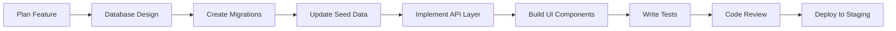

# Development Notes

This document captures key development insights, technical decisions, and implementation details for the Homni platform development process.

## Current Development Status

### Phase 1B: Module Access Management (✅ Complete)
**Completed**: January 9, 2025

#### Key Achievements
- **Full Module Access System**: Comprehensive role-based module access control
- **Database Consolidation**: Removed duplicate modules, standardized naming and categorization
- **Audit Trail**: Complete logging system for all module access changes
- **Bulk Operations**: Mass assignment and revocation of module access
- **Admin Integration**: Module management fully integrated into admin panel at `/admin/internal-access`
- **Security Policies**: All tables protected by appropriate RLS policies

#### Technical Implementation
```sql
-- Key database functions implemented
CREATE OR REPLACE FUNCTION initialize_user_module_access_by_role(uuid, user_role)
CREATE OR REPLACE FUNCTION get_modules_by_category(text[])
CREATE OR REPLACE FUNCTION bulk_toggle_user_modules_by_category(uuid, text, boolean)
CREATE OR REPLACE FUNCTION grant_core_modules_to_user(uuid)
CREATE OR REPLACE FUNCTION grant_admin_modules_to_user(uuid) 
CREATE OR REPLACE FUNCTION revoke_all_modules_from_user(uuid)
```

#### Files Modified/Created
- `src/modules/admin/components/ModuleAccessManager.tsx` - Main management interface
- `src/modules/admin/components/moduleAccess/` - Component library for module management
- `src/modules/admin/hooks/useModuleAccess.ts` - Business logic hook
- `supabase/migrations/20250909*.sql` - Database schema and functions
- Multiple supporting utilities and types

### Phase 2: Documentation & Route Standardization (🚧 In Progress)
**Started**: January 9, 2025

#### Objectives
1. **Documentation Consolidation**: Create structured docs hierarchy
2. **Route Objects Standard**: Eliminate JSX `<Route>` elements  
3. **Canonical Roles**: Make `user_profiles.role` authoritative
4. **Distinct Dashboards**: Five unique role-based experiences
5. **CI/CD Pipeline**: Comprehensive quality gates
6. **Seed Infrastructure**: Idempotent test user system

## Technical Architecture Decisions

### 1. Database Design Patterns

#### Row Level Security (RLS) Strategy
All user data tables follow this RLS pattern:
```sql
-- Owner access pattern
CREATE POLICY "users_own_data" ON table_name FOR ALL
USING (auth.uid() = user_id);

-- Admin oversight pattern (view/manage, not accept leads)
CREATE POLICY "admin_oversight" ON table_name FOR SELECT
USING (
  EXISTS (
    SELECT 1 FROM user_profiles 
    WHERE user_id = auth.uid() 
    AND role IN ('admin', 'master_admin')
  )
);

-- Role-based feature access
CREATE POLICY "role_feature_access" ON table_name FOR ALL
USING (
  auth.uid() IN (
    SELECT up.user_id FROM user_profiles up
    JOIN user_modules um ON up.user_id = um.user_id
    JOIN system_modules sm ON um.module_id = sm.id
    WHERE sm.name = 'required_module' AND um.has_access = true
  )
);
```

#### Migration Standards
Every schema change includes:
1. **Forward migration** with proper error handling
2. **Rollback script** (`*_down.sql`) for safe reversal
3. **Data validation** before and after migration
4. **Performance impact assessment** for large tables

```sql
-- Example migration structure
-- 20250109_add_user_preferences.sql
BEGIN;
  -- Add column with default
  ALTER TABLE user_profiles 
  ADD COLUMN preferences JSONB DEFAULT '{}';
  
  -- Update existing records
  UPDATE user_profiles SET preferences = '{}' WHERE preferences IS NULL;
  
  -- Add constraint
  ALTER TABLE user_profiles 
  ALTER COLUMN preferences SET NOT NULL;
COMMIT;

-- 20250109_add_user_preferences_down.sql  
BEGIN;
  ALTER TABLE user_profiles DROP COLUMN IF EXISTS preferences;
COMMIT;
```

### 2. Frontend Architecture Patterns

#### Module Structure
Each feature module follows consistent structure:
```
src/modules/[module-name]/
  ├── api/              # API functions, TanStack Query hooks
  ├── components/       # React components specific to module  
  ├── hooks/           # Custom hooks for module logic
  ├── pages/           # Route components and layouts
  ├── types/           # TypeScript interfaces and types
  ├── utils/           # Module-specific utilities
  ├── __tests__/       # Unit and integration tests
  └── README.md        # Module documentation
```

#### Component Design Patterns
```typescript
// Standard component structure
interface ComponentProps {
  // Always define explicit prop interfaces
}

export function Component({ ...props }: ComponentProps) {
  // 1. Hooks at top
  const { data, isLoading } = useQuery(...);
  const [localState, setLocalState] = useState();
  
  // 2. Event handlers (memoized if needed)
  const handleAction = useCallback(() => {
    // Implementation
  }, [dependencies]);
  
  // 3. Early returns for loading/error states
  if (isLoading) return <LoadingSkeleton />;
  if (error) return <ErrorState />;
  
  // 4. Main render
  return (
    <div>
      {/* Component content */}
    </div>
  );
}
```

#### State Management Strategy
- **Server State**: TanStack Query for all API interactions
- **Global State**: React Context for authentication and user preferences  
- **Local State**: useState for component-specific state
- **Form State**: React Hook Form for complex forms
- **URL State**: React Router for navigation and filters

### 3. Authentication & Authorization

#### Role Hierarchy and Permissions
```typescript
// Role-based permission system
export const rolePermissions = {
  guest: {
    canView: ['public_content', 'property_listings'],
    canCreate: ['lead_requests'],
    canEdit: [],
    canDelete: []
  },
  
  user: {
    canView: ['own_profile', 'own_properties', 'own_leads'],
    canCreate: ['properties', 'lead_requests'], 
    canEdit: ['own_profile', 'own_properties'],
    canDelete: ['own_properties']
  },
  
  company: {
    extends: 'user',
    canView: ['assigned_leads', 'company_analytics'],
    canCreate: ['lead_responses'],
    canEdit: ['company_profile', 'lead_status'],
    canDelete: []
  },
  
  admin: {
    canView: ['all_users', 'all_companies', 'all_leads', 'system_metrics'],
    canCreate: ['user_accounts', 'system_announcements'],
    canEdit: ['user_profiles', 'company_profiles', 'lead_assignments'],
    canDelete: ['spam_content'],
    cannotAccept: ['leads'] // Critical: admins oversee but don't participate
  },
  
  master_admin: {
    extends: 'admin',
    canView: ['system_configuration', 'security_logs'],
    canCreate: ['admin_accounts', 'system_configurations'],
    canEdit: ['user_roles', 'system_settings'],
    canDelete: ['accounts', 'sensitive_data'],
    cannotAccept: ['leads'] // Same restriction as admin
  }
};
```

#### Authentication Flow
```typescript
// Authentication context and flow
interface AuthContextType {
  user: User | null;
  isAuthenticated: boolean;
  isLoading: boolean;
  login: (email: string, password?: string) => Promise<void>;
  logout: () => Promise<void>;
  refreshUser: () => Promise<void>;
}

// Role-based route protection
function ProtectedRoute({ 
  children, 
  requiredRoles, 
  fallback = <Navigate to="/login" /> 
}: ProtectedRouteProps) {
  const { user, isLoading } = useAuth();
  
  if (isLoading) return <LoadingSpinner />;
  if (!user) return fallback;
  if (requiredRoles && !requiredRoles.includes(user.role)) {
    return <Navigate to="/unauthorized" />;
  }
  
  return <>{children}</>;
}
```

## Development Workflow

### 1. Feature Development Process


#### Development Checklist
- [ ] **Requirements Analysis**: Clear acceptance criteria defined
- [ ] **Database Design**: Schema changes with migrations and rollbacks
- [ ] **API Design**: RESTful endpoints with proper error handling
- [ ] **Component Design**: Reusable, testable React components
- [ ] **Type Safety**: Full TypeScript coverage with strict mode
- [ ] **Testing**: Unit, integration, and E2E tests written
- [ ] **Documentation**: README updates and inline documentation
- [ ] **Security Review**: RLS policies and permission checks
- [ ] **Performance**: Lazy loading, query optimization, bundle analysis
- [ ] **Accessibility**: WCAG 2.1 AA compliance verification

### 2. Code Quality Standards

#### TypeScript Configuration
```json
// tsconfig.json - Strict mode enforced
{
  "compilerOptions": {
    "strict": true,
    "noImplicitAny": true,
    "noImplicitReturns": true,
    "noFallthroughCasesInSwitch": true,
    "noUncheckedIndexedAccess": true,
    "exactOptionalPropertyTypes": true
  }
}
```

#### ESLint Rules
```json
// Key ESLint rules for code quality
{
  "rules": {
    "@typescript-eslint/no-explicit-any": "error",
    "@typescript-eslint/explicit-function-return-type": "warn",
    "react-hooks/rules-of-hooks": "error", 
    "react-hooks/exhaustive-deps": "warn",
    "import/order": ["error", { "groups": ["builtin", "external", "internal"] }]
  }
}
```

### 3. Testing Strategy

#### Test Categories and Coverage Targets
```typescript
// Testing pyramid with coverage targets
describe('Feature Testing Pyramid', () => {
  // Unit Tests (90% coverage target)
  describe('Unit Tests', () => {
    // Pure functions, hooks, utilities
    it('should calculate lead score correctly', () => {});
    it('should format property address', () => {});
    it('should validate user input', () => {});
  });
  
  // Integration Tests (80% coverage target)  
  describe('Integration Tests', () => {
    // Component + API interactions
    it('should load user profile on mount', () => {});
    it('should submit lead request successfully', () => {});
    it('should handle API errors gracefully', () => {});
  });
  
  // E2E Tests (Critical path coverage)
  describe('E2E Tests', () => {
    // Full user journeys
    it('should complete lead submission flow', () => {});
    it('should allow admin to manage users', () => {});
    it('should prevent unauthorized access', () => {});
  });
});
```

#### Mock Strategies
```typescript
// Consistent mocking patterns
export const mockFactories = {
  user: (overrides = {}) => ({
    id: 'user-123',
    email: 'test@example.com',
    role: 'user' as const,
    created_at: '2025-01-01T00:00:00Z',
    ...overrides
  }),
  
  lead: (overrides = {}) => ({
    id: 'lead-123',
    status: 'new' as const,
    property_type: 'residential',
    created_at: '2025-01-01T00:00:00Z',
    ...overrides
  }),
  
  company: (overrides = {}) => ({
    id: 'company-123',
    name: 'Test Company AS',
    active: true,
    created_at: '2025-01-01T00:00:00Z',
    ...overrides
  })
};
```

## Performance Optimization

### 1. Frontend Performance

#### Bundle Optimization
```typescript
// Vite configuration for optimal bundling
export default defineConfig({
  build: {
    rollupOptions: {
      output: {
        manualChunks: {
          // Vendor chunks
          vendor: ['react', 'react-dom'],
          ui: ['@radix-ui/react-dialog', '@radix-ui/react-dropdown-menu'],
          
          // Feature chunks
          auth: ['src/modules/auth/**/*'],
          leads: ['src/modules/leads/**/*'],
          admin: ['src/modules/admin/**/*']
        }
      }
    },
    
    // Performance budgets
    chunkSizeWarningLimit: 1000, // 1MB warning
    assetsInlineLimit: 4096 // 4KB inline limit
  }
});
```

#### React Performance Patterns
```typescript
// Memoization strategies
const ExpensiveUserList = memo(({ users, onUserClick }: Props) => {
  const sortedUsers = useMemo(() => 
    users.sort((a, b) => a.name.localeCompare(b.name)), 
    [users]
  );
  
  const handleUserClick = useCallback((userId: string) => {
    onUserClick(userId);
  }, [onUserClick]);
  
  return (
    <VirtualizedList
      items={sortedUsers}
      renderItem={({ user }) => (
        <UserCard 
          key={user.id}
          user={user} 
          onClick={() => handleUserClick(user.id)}
        />
      )}
    />
  );
});
```

### 2. Database Performance

#### Query Optimization
```sql
-- Index strategy for common queries
CREATE INDEX CONCURRENTLY idx_leads_company_status 
ON leads (company_id, status) WHERE status != 'archived';

CREATE INDEX CONCURRENTLY idx_user_profiles_role 
ON user_profiles (role) WHERE role IN ('admin', 'master_admin');

-- Optimized queries with proper indexes
SELECT l.*, up.display_name 
FROM leads l
JOIN user_profiles up ON l.user_id = up.user_id
WHERE l.company_id = $1 
  AND l.status = ANY($2)
  AND l.created_at >= $3
ORDER BY l.created_at DESC
LIMIT 50;
```

## Security Implementation

### 1. Database Security

#### RLS Policy Patterns
```sql
-- Standard RLS patterns used throughout the system

-- Own data access (user can access their own records)
CREATE POLICY "own_data_access" ON table_name
FOR ALL USING (auth.uid() = user_id);

-- Role-based access (admin can see relevant data)
CREATE POLICY "admin_access" ON table_name  
FOR SELECT USING (
  EXISTS (
    SELECT 1 FROM user_profiles 
    WHERE user_id = auth.uid() 
    AND role IN ('admin', 'master_admin')
  )
);

-- Feature-based access (module permissions)
CREATE POLICY "feature_access" ON table_name
FOR ALL USING (
  auth.uid() IN (
    SELECT um.user_id FROM user_modules um
    JOIN system_modules sm ON um.module_id = sm.id
    WHERE sm.name = 'required_feature' 
    AND um.has_access = true
  )
);
```

#### Function Security
```sql
-- All functions use SECURITY DEFINER with search_path
CREATE OR REPLACE FUNCTION secure_user_function(user_id uuid)
RETURNS json
LANGUAGE plpgsql
SECURITY DEFINER
SET search_path = public
AS $$
DECLARE
  result json;
BEGIN
  -- Validate caller permissions
  IF NOT EXISTS (
    SELECT 1 FROM user_profiles 
    WHERE user_profiles.user_id = auth.uid()
  ) THEN
    RAISE EXCEPTION 'Unauthorized access';
  END IF;
  
  -- Function logic here
  
  RETURN result;
END;
$$;
```

### 2. Frontend Security

#### Input Validation
```typescript
// Zod schemas for runtime validation
export const userProfileSchema = z.object({
  name: z.string()
    .min(1, 'Name is required')
    .max(100, 'Name too long')
    .regex(/^[a-zA-ZæøåÆØÅ\s-]+$/, 'Invalid characters in name'),
    
  email: z.string()
    .email('Invalid email format')
    .max(255, 'Email too long'),
    
  phone: z.string()
    .regex(/^(\+47)?[0-9]{8}$/, 'Invalid Norwegian phone number')
    .optional()
});

// Validation in API calls
export async function updateUserProfile(data: unknown) {
  const validatedData = userProfileSchema.parse(data);
  return await api.put('/users/profile', validatedData);
}
```

## Common Patterns and Solutions

### 1. Error Handling Patterns

#### API Error Handling
```typescript
// Standardized API error handling
class ApiError extends Error {
  constructor(
    message: string,
    public status: number,
    public code: string,
    public details?: unknown
  ) {
    super(message);
    this.name = 'ApiError';
  }
}

// Centralized error handling
export async function apiCall<T>(
  request: () => Promise<T>
): Promise<T> {
  try {
    return await request();
  } catch (error) {
    if (error instanceof ApiError) {
      // Log structured error
      console.error('API Error:', {
        message: error.message,
        status: error.status,
        code: error.code,
        details: error.details
      });
      
      // Show user-friendly message
      toast.error(getErrorMessage(error));
      throw error;
    }
    
    // Handle unexpected errors
    console.error('Unexpected error:', error);
    toast.error('An unexpected error occurred');
    throw new ApiError('Unexpected error', 500, 'UNKNOWN_ERROR');
  }
}
```

### 2. Data Fetching Patterns

#### TanStack Query Patterns
```typescript
// Query key factory pattern
export const leadQueries = {
  all: () => ['leads'] as const,
  lists: () => [...leadQueries.all(), 'list'] as const,
  list: (filters: LeadFilters) => [...leadQueries.lists(), filters] as const,
  details: () => [...leadQueries.all(), 'detail'] as const,
  detail: (id: string) => [...leadQueries.details(), id] as const
};

// Custom hook with error handling
export function useLeads(filters: LeadFilters = {}) {
  return useQuery({
    queryKey: leadQueries.list(filters),
    queryFn: () => fetchLeads(filters),
    staleTime: 5 * 60 * 1000, // 5 minutes
    cacheTime: 10 * 60 * 1000, // 10 minutes
    retry: (failureCount, error) => {
      if (error instanceof ApiError && error.status >= 400 && error.status < 500) {
        return false; // Don't retry client errors
      }
      return failureCount < 3;
    }
  });
}
```

## Deployment and Operations

### 1. Environment Configuration
```typescript
// Environment-specific configuration
export const config = {
  development: {
    apiUrl: 'http://localhost:54321',
    supabaseUrl: process.env.VITE_SUPABASE_URL!,
    supabaseAnonKey: process.env.VITE_SUPABASE_ANON_KEY!,
    enableDevTools: true,
    logLevel: 'debug'
  },
  
  staging: {
    apiUrl: 'https://staging-api.homni.no',
    supabaseUrl: process.env.VITE_SUPABASE_URL!,
    supabaseAnonKey: process.env.VITE_SUPABASE_ANON_KEY!,
    enableDevTools: false,
    logLevel: 'info'
  },
  
  production: {
    apiUrl: 'https://api.homni.no',
    supabaseUrl: process.env.VITE_SUPABASE_URL!,
    supabaseAnonKey: process.env.VITE_SUPABASE_ANON_KEY!,
    enableDevTools: false,
    logLevel: 'error'
  }
};
```

### 2. CI/CD Pipeline
```yaml
# GitHub Actions workflow for quality assurance
name: CI/CD Pipeline

on: [push, pull_request]

jobs:
  quality-check:
    runs-on: ubuntu-latest
    steps:
      - uses: actions/checkout@v4
      
      - name: Setup Node.js
        uses: actions/setup-node@v4
        with:
          node-version: '18'
          cache: 'npm'
          
      - name: Install dependencies
        run: npm ci
        
      - name: Type check
        run: npm run typecheck
        
      - name: Lint
        run: npm run lint
        
      - name: Build
        run: npm run build
        
      - name: Unit tests
        run: npm run test -- --coverage
        
      - name: E2E tests
        run: npm run test:e2e
        
      - name: Security audit
        run: npm audit --audit-level=high
```

This document serves as a living record of development decisions and patterns. It should be updated as new patterns emerge and architectural decisions are made.