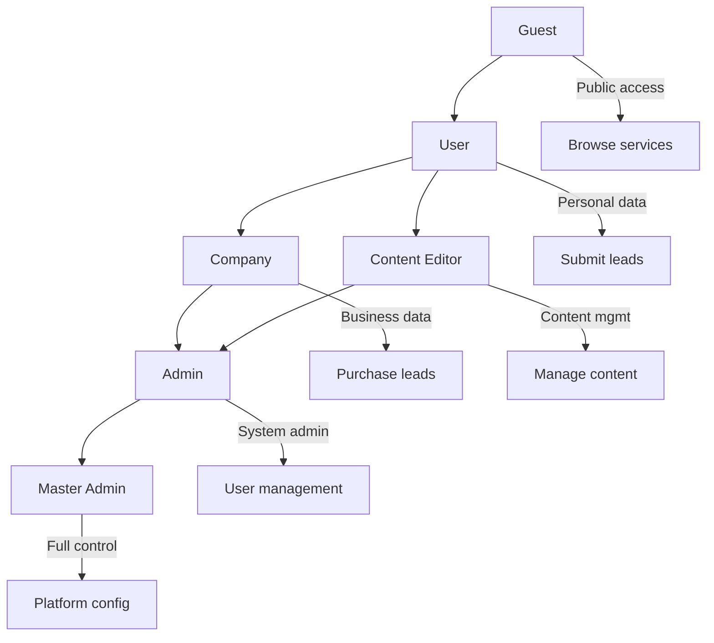
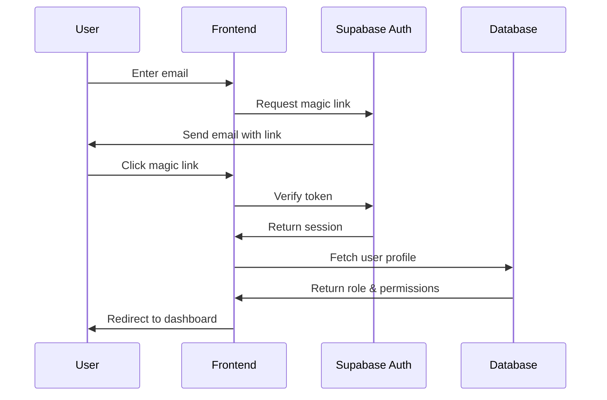

# Authentication & Authorization System

## 🔐 Authentication Architecture

Homni uses **Supabase Auth** with a custom role-based permission system built on top of PostgreSQL Row Level Security (RLS).

## 👥 Role Hierarchy



### Role Definitions

#### Guest (Unauthenticated)
- **Permissions**: Browse services, view public content, submit leads
- **Restrictions**: No persistent data, limited functionality
- **Use Cases**: Service discovery, initial lead submission

#### User (Authenticated Individual)
- **Permissions**: Personal dashboard, lead management, profile editing
- **Data Access**: Own leads, own profile, public content
- **Use Cases**: Homeowners seeking services, lead tracking

#### Company (Business Account)
- **Permissions**: Business dashboard, lead purchasing, team management
- **Data Access**: Company leads, team member data, purchased leads
- **Use Cases**: Service providers, lead buying, team coordination

#### Content Editor
- **Permissions**: Content management, publishing workflow, media uploads
- **Data Access**: All content, draft materials, publishing queue
- **Use Cases**: Content creation, blog management, marketing materials

#### Admin (System Administrator)
- **Permissions**: User management, lead distribution, system monitoring
- **Data Access**: All users (read), lead oversight, system metrics
- **Use Cases**: Customer support, lead distribution management

#### Master Admin (Platform Owner)
- **Permissions**: Full platform control, role assignment, configuration
- **Data Access**: Complete system access, all data modification
- **Use Cases**: Platform configuration, critical system changes

## 🛡 Security Implementation

### Row Level Security (RLS) Policies

#### User Profile Access
```sql
-- Users can only view/edit their own profile
CREATE POLICY "user_profile_access" ON user_profiles
  FOR ALL USING (auth.uid() = user_id);

-- Admins can view all profiles for management
CREATE POLICY "admin_profile_oversight" ON user_profiles
  FOR SELECT USING (
    EXISTS (
      SELECT 1 FROM user_profiles 
      WHERE user_id = auth.uid() 
      AND role IN ('admin', 'master_admin')
    )
  );
```

#### Company Data Isolation
```sql
-- Company members can access shared company data
CREATE POLICY "company_data_access" ON leads
  FOR SELECT USING (
    -- Own leads
    auth.uid() = user_id OR
    -- Company assigned leads
    EXISTS (
      SELECT 1 FROM lead_assignments la
      JOIN user_profiles up ON up.company_id = la.company_id
      WHERE la.lead_id = id AND up.user_id = auth.uid()
    )
  );
```

#### Administrative Oversight
```sql
-- Admins can oversee lead distribution
CREATE POLICY "admin_lead_oversight" ON leads
  FOR SELECT USING (
    -- Regular user access OR admin oversight
    auth.uid() = user_id OR
    EXISTS (
      SELECT 1 FROM user_profiles 
      WHERE user_id = auth.uid() 
      AND role IN ('admin', 'master_admin')
    )
  );
```

### Permission Validation

#### Frontend Route Protection
```typescript
// Role-based route guarding
export const useRoleGuard = (requiredRoles: UserRole[]) => {
  const { user, role } = useAuth();
  const navigate = useNavigate();

  useEffect(() => {
    if (!user) {
      navigate('/login');
      return;
    }

    if (!requiredRoles.includes(role)) {
      navigate('/unauthorized');
      return;
    }
  }, [user, role, requiredRoles, navigate]);

  return { 
    hasAccess: user && requiredRoles.includes(role),
    isLoading: !user && !role 
  };
};
```

#### API Authorization Middleware
```typescript
// Server-side permission checking
export const requireRole = (allowedRoles: UserRole[]) => {
  return async (req: Request, res: Response, next: NextFunction) => {
    const user = await getUser(req);
    
    if (!user) {
      return res.status(401).json({ error: 'Authentication required' });
    }

    const userRole = await getUserRole(user.id);
    
    if (!allowedRoles.includes(userRole)) {
      return res.status(403).json({ error: 'Insufficient permissions' });
    }

    req.user = user;
    req.userRole = userRole;
    next();
  };
};
```

## 🔑 Authentication Flow

### Initial Authentication


### Session Management
```typescript
// Automatic session refresh
export const useAuthSession = () => {
  const [session, setSession] = useState<Session | null>(null);
  const [loading, setLoading] = useState(true);

  useEffect(() => {
    // Get initial session
    supabase.auth.getSession().then(({ data: { session } }) => {
      setSession(session);
      setLoading(false);
    });

    // Listen for auth changes
    const { data: { subscription } } = supabase.auth.onAuthStateChange(
      (_event, session) => {
        setSession(session);
        setLoading(false);
      }
    );

    return () => subscription.unsubscribe();
  }, []);

  return { session, loading };
};
```

### Role Resolution
```typescript
// Get user role from database
export const getUserRole = async (userId: string): Promise<UserRole> => {
  const { data, error } = await supabase
    .from('user_profiles')
    .select('role')
    .eq('user_id', userId)
    .single();

  if (error || !data) {
    return 'guest';
  }

  return data.role as UserRole;
};
```

## 🔧 Permission System

### Feature Flag Integration
```typescript
// Role-based feature access
export const useFeatureAccess = (flagName: string) => {
  const { role } = useAuth();
  const { data: flags } = useFeatureFlags();

  const hasAccess = useMemo(() => {
    const flag = flags?.find(f => f.name === flagName);
    if (!flag?.is_enabled) return false;
    
    // Check role-based targeting
    if (flag.target_roles?.length > 0) {
      return flag.target_roles.includes(role);
    }
    
    return true;
  }, [flags, flagName, role]);

  return hasAccess;
};
```

### Dynamic Permission Checks
```typescript
// Runtime permission validation
export const hasPermission = (
  userRole: UserRole, 
  resource: string, 
  action: string
): boolean => {
  const permissions: Record<UserRole, Record<string, string[]>> = {
    guest: {
      services: ['read'],
      leads: ['create']
    },
    user: {
      services: ['read'],
      leads: ['create', 'read'],
      profile: ['read', 'update']
    },
    company: {
      services: ['read'],
      leads: ['read', 'purchase'],
      profile: ['read', 'update'],
      team: ['read', 'manage']
    },
    content_editor: {
      content: ['create', 'read', 'update', 'delete', 'publish'],
      media: ['upload', 'manage']
    },
    admin: {
      users: ['read', 'manage'],
      leads: ['read', 'manage', 'distribute'],
      system: ['monitor', 'configure']
    },
    master_admin: {
      '*': ['*'] // Full access
    }
  };

  const rolePermissions = permissions[userRole];
  if (!rolePermissions) return false;

  // Master admin has full access
  if (rolePermissions['*']?.includes('*')) return true;

  const resourcePermissions = rolePermissions[resource];
  if (!resourcePermissions) return false;

  return resourcePermissions.includes(action) || resourcePermissions.includes('*');
};
```

## 🚨 Security Considerations

### Token Security
- **Automatic refresh**: Sessions refreshed before expiration
- **Secure storage**: Tokens stored in httpOnly cookies where possible
- **CSRF protection**: Cross-site request forgery prevention
- **Session timeout**: Automatic logout after inactivity

### Data Protection
- **Encryption at rest**: All sensitive data encrypted in database
- **Encryption in transit**: HTTPS/TLS for all communications
- **Audit logging**: All admin actions logged with attribution
- **Data retention**: Automatic cleanup of expired sessions and logs

### Vulnerability Mitigation
- **SQL injection**: Prevented by prepared statements and RLS
- **XSS protection**: Input sanitization and Content Security Policy
- **Rate limiting**: API request throttling by user and IP
- **Brute force protection**: Account lockout after failed attempts

## 🔄 Role Transitions

### User Upgrades
```typescript
// Upgrade user to company account
export const upgradeToCompany = async (
  userId: string, 
  companyData: CompanyProfile
) => {
  const { error } = await supabase.rpc('upgrade_user_to_company', {
    p_user_id: userId,
    p_company_data: companyData
  });

  if (error) throw error;
  
  // Refresh user session to get new role
  await supabase.auth.refreshSession();
};
```

### Admin Role Assignment
```sql
-- Database function for secure role changes
CREATE OR REPLACE FUNCTION assign_user_role(
  p_target_user_id UUID,
  p_new_role user_role,
  p_admin_user_id UUID
) RETURNS void AS $$
BEGIN
  -- Verify admin has permission
  IF NOT EXISTS (
    SELECT 1 FROM user_profiles 
    WHERE user_id = p_admin_user_id 
    AND role IN ('admin', 'master_admin')
  ) THEN
    RAISE EXCEPTION 'Insufficient permissions to assign roles';
  END IF;
  
  -- Update target user role
  UPDATE user_profiles 
  SET role = p_new_role, updated_at = now()
  WHERE user_id = p_target_user_id;
  
  -- Log the role change
  INSERT INTO audit_log (action, user_id, target_id, details)
  VALUES ('role_change', p_admin_user_id, p_target_user_id, 
          json_build_object('new_role', p_new_role));
END;
$$ LANGUAGE plpgsql SECURITY DEFINER;
```