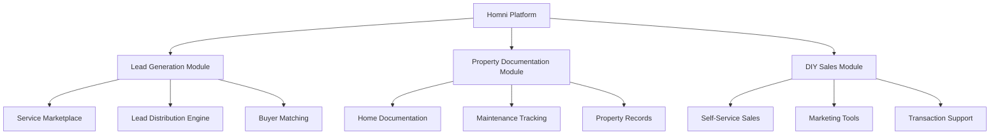
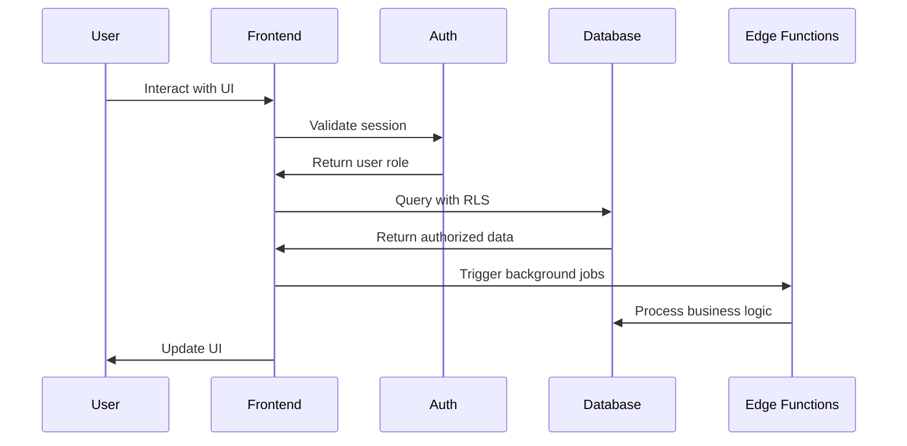

# System Architecture Overview

## 🏗 Platform Architecture

Homni is built as a modular, role-based platform combining three core business models:



## 🎯 Core Principles

### 1. Role-Based Architecture
- **Guest**: Browse services, submit leads
- **User**: Personal dashboard, lead management
- **Company**: Business dashboard, lead purchasing, team management
- **Content Editor**: Content management, publishing workflow
- **Admin**: System administration, lead distribution oversight
- **Master Admin**: Full platform control, role management

### 2. Modular Design
```
src/
├── modules/
│   ├── auth/          # Authentication & authorization
│   ├── leads/         # Lead generation & distribution
│   ├── property/      # Property documentation
│   ├── sales/         # DIY sales tools
│   └── admin/         # Administrative interfaces
├── components/        # Shared UI components
├── pages/            # Route-level pages
└── lib/              # Core utilities & integrations
```

### 3. Plugin Architecture
- **Feature Flags**: Runtime feature control
- **Module Metadata**: Dynamic module loading
- **Extensible**: New modules can be added without core changes

## 🔧 Technical Stack

### Frontend
- **React 18** with TypeScript
- **Vite** for build tooling
- **Tailwind CSS** for styling with design system
- **React Router** for client-side routing
- **Tanstack Query** for state management

### Backend
- **Supabase** for database and authentication
- **PostgreSQL** with Row Level Security (RLS)
- **Edge Functions** for server-side logic
- **Real-time subscriptions** for live updates

### Infrastructure
- **CI/CD** with GitHub Actions
- **Automated testing** with Vitest and Playwright
- **Code quality** with ESLint and Prettier
- **Security scanning** with automated tools

## 🔄 Data Flow



## 🛡 Security Model

### Row Level Security (RLS)
- **User isolation**: Users can only access their own data
- **Company isolation**: Company members share data within organization
- **Admin oversight**: Admins have controlled access for management
- **Audit trails**: All changes tracked with user attribution

### Authentication Flow
- **Passwordless login** with email/SMS
- **Session management** with secure tokens
- **Role-based permissions** enforced at database level
- **Multi-factor authentication** for elevated roles

## 📊 Performance Considerations

### Frontend Optimization
- **Lazy loading** of route components
- **Code splitting** by modules
- **Image optimization** with responsive loading
- **Bundle size monitoring** with automated checks

### Database Performance
- **Efficient indexing** on commonly queried columns
- **Query optimization** with proper joins and filtering
- **Connection pooling** for scalable connections
- **Caching strategies** for frequently accessed data

## 🔮 Future Architecture

### Planned Enhancements
- **Microservices** migration for high-traffic modules
- **Event-driven** architecture with message queues
- **AI integration** for lead matching and recommendations
- **Multi-tenant** support for white-label deployments

### Scalability Roadmap
- **Horizontal scaling** with load balancers
- **Database sharding** for large datasets
- **CDN integration** for global content delivery
- **Monitoring & observability** with comprehensive metrics