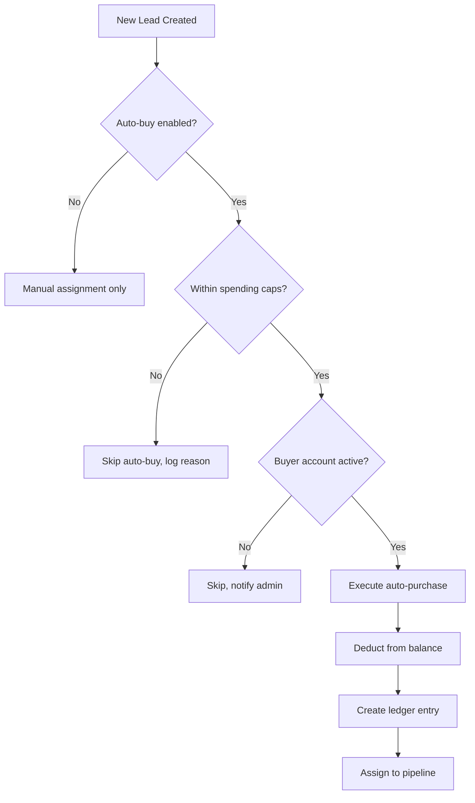

# Buyer Capability - Data Models & Business Logic

> **Versjon:** 1.0  
> **Fokus:** Lead marketplace kjøper-funksjonalitet  
> **RLS Status:** ✅ Implementert og testet

## 🏗️ **CORE TABLES**

### **buyer_accounts**
```sql
CREATE TABLE public.buyer_accounts (
  id UUID PRIMARY KEY DEFAULT gen_random_uuid(),
  user_id UUID REFERENCES auth.users(id) NOT NULL,
  company_name TEXT NOT NULL,
  contact_email TEXT NOT NULL,
  phone TEXT,
  industry TEXT,
  is_active BOOLEAN DEFAULT true,
  onboarding_completed BOOLEAN DEFAULT false,
  credit_limit_cents INTEGER DEFAULT 0,
  current_balance_cents INTEGER DEFAULT 0,
  auto_recharge_enabled BOOLEAN DEFAULT false,
  auto_recharge_threshold_cents INTEGER DEFAULT 10000, -- €100
  auto_recharge_amount_cents INTEGER DEFAULT 50000,    -- €500
  created_at TIMESTAMPTZ DEFAULT now(),
  updated_at TIMESTAMPTZ DEFAULT now()
);
```

**RLS Policies:**
- ✅ Buyers can view/update own account
- ✅ Admins can view/manage all accounts
- ❌ No anonymous access

---

### **buyer_package_subscriptions**
```sql
CREATE TABLE public.buyer_package_subscriptions (
  id UUID PRIMARY KEY DEFAULT gen_random_uuid(),
  buyer_id UUID REFERENCES buyer_accounts(id) NOT NULL,
  package_id UUID REFERENCES lead_packages(id) NOT NULL,
  is_active BOOLEAN DEFAULT true,
  auto_buy BOOLEAN DEFAULT false,
  daily_cap_cents INTEGER, -- NULL = no limit
  monthly_cap_cents INTEGER, -- NULL = no limit
  is_paused BOOLEAN DEFAULT false,
  pause_reason TEXT,
  paused_until TIMESTAMPTZ,
  priority_level INTEGER DEFAULT 5, -- 1-10, higher = more priority
  created_at TIMESTAMPTZ DEFAULT now(),
  updated_at TIMESTAMPTZ DEFAULT now(),
  
  UNIQUE(buyer_id, package_id)
);
```

**Business Logic:**
- **Auto-buy:** When enabled, automatically purchases qualifying leads within caps
- **Daily/Monthly Caps:** Spending limits reset at midnight/month start
- **Pause System:** Temporary suspension with optional auto-resume
- **Priority:** Higher priority buyers get leads first (within same package)

---

### **buyer_spend_ledger**
```sql
CREATE TABLE public.buyer_spend_ledger (
  id UUID PRIMARY KEY DEFAULT gen_random_uuid(),
  buyer_id UUID REFERENCES buyer_accounts(id) NOT NULL,
  lead_id UUID REFERENCES leads(id),
  transaction_type TEXT NOT NULL, -- 'purchase', 'refund', 'credit', 'debit'
  amount_cents INTEGER NOT NULL, -- positive for debits, negative for credits
  description TEXT NOT NULL,
  reference_id TEXT, -- external payment reference
  processed_at TIMESTAMPTZ DEFAULT now(),
  processed_by UUID REFERENCES auth.users(id),
  
  INDEX(buyer_id, processed_at),
  INDEX(lead_id)
);
```

**Transaction Types:**
- `purchase`: Lead bought from marketplace
- `refund`: Lead purchase reversed  
- `credit`: Account topped up
- `debit`: Manual charge/adjustment

---

### **lead_assignments**
```sql
CREATE TABLE public.lead_assignments (
  id UUID PRIMARY KEY DEFAULT gen_random_uuid(),
  lead_id UUID REFERENCES leads(id) NOT NULL,
  buyer_id UUID REFERENCES buyer_accounts(id) NOT NULL,
  package_id UUID REFERENCES lead_packages(id) NOT NULL,
  assignment_type TEXT NOT NULL, -- 'auto', 'manual', 'purchased'
  is_purchased BOOLEAN DEFAULT false,
  purchase_price_cents INTEGER,
  pipeline_stage TEXT DEFAULT 'new', -- 'new', 'in_progress', 'won', 'lost'
  assigned_at TIMESTAMPTZ DEFAULT now(),
  purchased_at TIMESTAMPTZ,
  stage_updated_at TIMESTAMPTZ DEFAULT now(),
  notes TEXT,
  
  UNIQUE(lead_id, buyer_id)
);
```

**Pipeline Stages:**
- 🌟 `new`: Freshly assigned/purchased lead
- 🚀 `in_progress`: Buyer is working the lead  
- 🏆 `won`: Lead converted to customer
- ❌ `lost`: Lead did not convert

---

## 💰 **BUSINESS RULES**

### **Spending Caps Logic**
```typescript
interface SpendingCheck {
  dailySpent: number;    // cents spent today
  monthlySpent: number;  // cents spent this month
  dailyLimit: number | null;   // daily cap or null for unlimited
  monthlyLimit: number | null; // monthly cap or null for unlimited
  canPurchase: boolean;  // can buyer purchase this lead?
  reasonBlocked?: string; // why purchase is blocked
}

function checkSpendingCaps(buyerId: string, leadPrice: number): SpendingCheck {
  // Implementation checks current spend vs caps
  // Returns whether purchase is allowed
}
```

### **Auto-Buy Decision Tree**


### **Lead Distribution Algorithm**
1. **Filter eligible buyers** (active subscription, not paused, caps OK)
2. **Sort by priority** (higher priority first)
3. **Round-robin within priority** (fair distribution)
4. **Auto-buy if enabled** (immediate purchase + assignment)
5. **Manual review otherwise** (assignment without purchase)

---

## 🔐 **RLS SECURITY IMPLEMENTATION**

### **Row Level Security Policies**

```sql
-- buyer_accounts: Own account access
CREATE POLICY "buyers_own_account" ON buyer_accounts
FOR ALL TO authenticated
USING (user_id = auth.uid());

CREATE POLICY "admin_all_buyers" ON buyer_accounts  
FOR ALL TO authenticated
USING (public.get_current_user_role() IN ('admin', 'master_admin'));

-- buyer_package_subscriptions: Own subscriptions
CREATE POLICY "buyers_own_subscriptions" ON buyer_package_subscriptions
FOR ALL TO authenticated  
USING (
  buyer_id IN (
    SELECT id FROM buyer_accounts WHERE user_id = auth.uid()
  )
);

-- buyer_spend_ledger: Own transactions
CREATE POLICY "buyers_own_ledger" ON buyer_spend_ledger
FOR SELECT TO authenticated
USING (
  buyer_id IN (
    SELECT id FROM buyer_accounts WHERE user_id = auth.uid()
  )
);

-- lead_assignments: Assigned leads only
CREATE POLICY "buyers_assigned_leads" ON lead_assignments
FOR ALL TO authenticated
USING (
  buyer_id IN (
    SELECT id FROM buyer_accounts WHERE user_id = auth.uid()
  ) OR
  public.get_current_user_role() IN ('admin', 'master_admin')
);
```

### **Security Functions**
```sql
-- Check if user can manage buyer account
CREATE OR REPLACE FUNCTION public.can_manage_buyer_account(account_id UUID)
RETURNS BOOLEAN AS $$
BEGIN
  RETURN (
    -- Owner access
    EXISTS (
      SELECT 1 FROM buyer_accounts 
      WHERE id = account_id AND user_id = auth.uid()
    ) OR
    -- Admin access
    public.get_current_user_role() IN ('admin', 'master_admin')
  );
END;
$$ LANGUAGE plpgsql SECURITY DEFINER SET search_path = public;
```

---

## 📊 **KEY METRICS & KPIs**

### **Buyer Performance**
- **Conversion Rate:** Won leads / Total assigned leads
- **Response Time:** Time from assignment to first contact  
- **Spend Efficiency:** Revenue per € spent on leads
- **Pipeline Velocity:** Average time from new → won

### **System Health**
- **Auto-buy Rate:** % of leads auto-purchased vs manual
- **Cap Utilization:** % of buyers hitting daily/monthly limits
- **Pause Frequency:** How often buyers pause subscriptions
- **Balance Health:** Average account balance vs spending rate

### **Business Intelligence**
```sql
-- Top performing buyers by conversion
SELECT 
  ba.company_name,
  COUNT(*) FILTER (WHERE la.pipeline_stage = 'won') as won_leads,
  COUNT(*) as total_leads,
  ROUND(COUNT(*) FILTER (WHERE la.pipeline_stage = 'won') * 100.0 / COUNT(*), 2) as conversion_rate
FROM buyer_accounts ba
JOIN lead_assignments la ON ba.id = la.buyer_id
WHERE la.assigned_at >= now() - interval '30 days'
GROUP BY ba.id, ba.company_name
ORDER BY conversion_rate DESC;
```

---

**🎯 STATUS:** Fully implemented and production-ready  
**🛡️ SECURITY:** RLS policies active, all access controlled  
**📈 PERFORMANCE:** Optimized queries with proper indexing  
**🧪 TESTING:** Unit tests + integration tests + E2E coverage