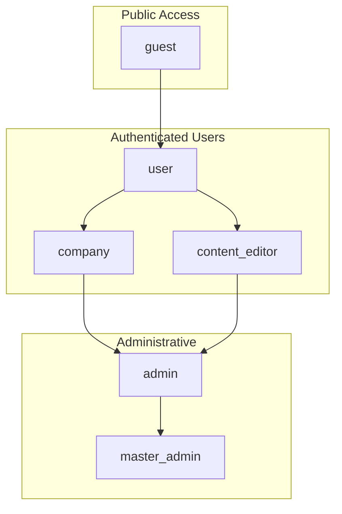
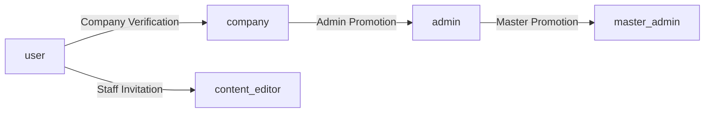

# User Roles and Permissions

This document defines the authoritative user role system for the Homni platform. The `user_profiles.role` field is the single source of truth for all role-based access control.

## Role Hierarchy

The Homni platform implements six distinct user roles, each with specific permissions and access patterns:



## Role Definitions

### `guest` - Unauthenticated Visitors
**Purpose**: Public access to marketing content and lead submission

**Capabilities**:
- Browse public content (articles, guides, property listings)
- Submit lead inquiries via contact forms
- View company profiles and services
- Access property search and filtering

**Restrictions**:
- Cannot access user dashboard
- Cannot save searches or favorites
- Cannot view lead status or history
- No access to administrative functions

**Dashboard**: Public landing page with lead capture forms

**Navigation**:
```typescript
const guestNav = [
  { key: 'home', path: '/', label: 'Home' },
  { key: 'properties', path: '/properties', label: 'Properties' },
  { key: 'companies', path: '/companies', label: 'Service Providers' },
  { key: 'guides', path: '/guides', label: 'Guides' },
  { key: 'login', path: '/login', label: 'Login' }
];
```

### `user` - Regular Authenticated Users  
**Purpose**: Individual property owners and homebuyers

**Capabilities**:
- All guest capabilities plus:
- Personal dashboard with property portfolio
- Submit and track lead requests
- Save favorite properties and searches
- Manage personal profile and preferences
- Access property documentation tools
- Receive notifications about lead status

**Restrictions**:
- Cannot access leads submitted to companies
- Cannot manage other users
- No administrative access
- Cannot create or edit content

**Dashboard**: Personal property management interface

**Navigation**:
```typescript
const userNav = [
  { key: 'dashboard', path: '/dashboard', label: 'My Dashboard' },
  { key: 'properties', path: '/properties', label: 'My Properties' },
  { key: 'leads', path: '/my-leads', label: 'My Requests' },
  { key: 'documents', path: '/documents', label: 'Documents' },
  { key: 'profile', path: '/profile', label: 'Profile' }
];
```

### `company` - Business Users
**Purpose**: Service providers receiving and managing leads

**Capabilities**:
- All user capabilities plus:
- Company dashboard with lead management
- Receive leads based on service areas and preferences
- Manage lead pipeline (New → In Progress → Won → Lost)
- Configure lead distribution preferences
- View analytics and performance metrics
- Manage company profile and service offerings
- Team member management (if applicable)

**Restrictions**:
- Cannot access leads from other companies
- Cannot modify system-wide settings
- No administrative access to user accounts
- Cannot create or edit marketing content

**Dashboard**: Lead management and company analytics interface

**Navigation**:
```typescript
const companyNav = [
  { key: 'dashboard', path: '/company', label: 'Company Dashboard' },
  { key: 'leads', path: '/leads', label: 'Lead Inbox' },
  { key: 'pipeline', path: '/pipeline', label: 'Lead Pipeline' },
  { key: 'analytics', path: '/analytics', label: 'Analytics' },
  { key: 'settings', path: '/company/settings', label: 'Company Settings' },
  { key: 'team', path: '/team', label: 'Team Management' }
];
```

### `content_editor` - Content Managers
**Purpose**: Create and manage marketing content and guides

**Capabilities**:
- All user capabilities plus:
- Content management dashboard
- Create, edit, and publish articles
- Manage media library and assets
- Configure SEO settings for content
- Preview content before publication
- Manage content categories and tags
- View content analytics and engagement metrics

**Restrictions**:
- Cannot access user or company management
- Cannot access lead data or analytics
- No system administration capabilities
- Cannot modify user roles or permissions

**Dashboard**: Content management system interface

**Navigation**:
```typescript
const contentEditorNav = [
  { key: 'dashboard', path: '/content', label: 'Content Dashboard' },
  { key: 'articles', path: '/content/articles', label: 'Articles' },
  { key: 'pages', path: '/content/pages', label: 'Pages' },
  { key: 'media', path: '/content/media', label: 'Media Library' },
  { key: 'analytics', path: '/content/analytics', label: 'Content Analytics' },
  { key: 'profile', path: '/profile', label: 'Profile' }
];
```

### `admin` - System Administrators
**Purpose**: Manage users, companies, and system operations

**Capabilities**:
- All content_editor capabilities plus:
- Administrative dashboard with system overview
- User account management (create, edit, suspend)
- Company account management and verification
- Lead oversight and reassignment (cannot accept leads)
- System configuration and feature flag management
- Access to all audit logs and system metrics
- Module access control for users and companies
- Support ticket management and resolution

**Key Restriction**: **Cannot accept or process leads** - admins can view and reassign leads but cannot mark them as won/completed to maintain neutrality

**Dashboard**: System administration interface

**Navigation**:
```typescript
const adminNav = [
  { key: 'dashboard', path: '/admin', label: 'Admin Dashboard' },
  { key: 'users', path: '/admin/users', label: 'User Management' },
  { key: 'companies', path: '/admin/companies', label: 'Company Management' },
  { key: 'leads', path: '/admin/leads', label: 'Lead Control Center' },
  { key: 'modules', path: '/admin/modules', label: 'Module Access' },
  { key: 'content', path: '/admin/content', label: 'Content Review' },
  { key: 'system', path: '/admin/system', label: 'System Settings' },
  { key: 'audit', path: '/admin/audit', label: 'Audit Logs' }
];
```

### `master_admin` - Super Administrator
**Purpose**: Full system access and configuration

**Capabilities**:
- All admin capabilities plus:
- Master system configuration
- Role management and assignment
- Database administration tools
- Feature flag management and deployment
- Security configuration and monitoring
- System backup and recovery operations
- Integration management (APIs, third-party services)
- Performance monitoring and optimization tools

**Same Restriction**: **Cannot accept or process leads** - maintains complete neutrality in business operations

**Dashboard**: Master system control interface

**Navigation**:
```typescript
const masterAdminNav = [
  { key: 'dashboard', path: '/master', label: 'Master Dashboard' },
  { key: 'system', path: '/master/system', label: 'System Control' },
  { key: 'security', path: '/master/security', label: 'Security Center' },
  { key: 'performance', path: '/master/performance', label: 'Performance' },
  { key: 'integrations', path: '/master/integrations', label: 'Integrations' },
  { key: 'features', path: '/master/features', label: 'Feature Management' },
  { key: 'backup', path: '/master/backup', label: 'Backup & Recovery' },
  // Include all admin navigation as well
  ...adminNav
];
```

## Database Implementation

### Role Enum Definition
```sql
CREATE TYPE user_role AS ENUM (
  'guest',
  'user', 
  'company',
  'content_editor',
  'admin',
  'master_admin'
);
```

### Profile Table Schema
```sql
CREATE TABLE user_profiles (
  id uuid PRIMARY KEY DEFAULT gen_random_uuid(),
  user_id uuid REFERENCES auth.users(id) ON DELETE CASCADE,
  role user_role NOT NULL DEFAULT 'user',
  display_name text,
  avatar_url text,
  notification_preferences jsonb DEFAULT '{}',
  ui_preferences jsonb DEFAULT '{}',
  feature_overrides jsonb DEFAULT '{}',
  created_at timestamptz DEFAULT now(),
  updated_at timestamptz DEFAULT now(),
  UNIQUE(user_id)
);
```

### Role-Based RLS Policies

```sql
-- Users can view their own profile
CREATE POLICY "users_view_own_profile" 
ON user_profiles FOR SELECT 
USING (auth.uid() = user_id);

-- Admins can view all profiles  
CREATE POLICY "admins_view_all_profiles" 
ON user_profiles FOR SELECT 
USING (
  EXISTS (
    SELECT 1 FROM user_profiles up 
    WHERE up.user_id = auth.uid() 
    AND up.role IN ('admin', 'master_admin')
  )
);

-- Only master_admin can modify roles
CREATE POLICY "master_admin_modify_roles" 
ON user_profiles FOR UPDATE 
USING (
  EXISTS (
    SELECT 1 FROM user_profiles up 
    WHERE up.user_id = auth.uid() 
    AND up.role = 'master_admin'
  )
);
```

## Access Control Implementation

### Role-Based Route Protection
```typescript
// Route access configuration
export const roleRouteAccess = {
  '/dashboard': ['user', 'company', 'content_editor', 'admin', 'master_admin'],
  '/company': ['company'],
  '/content': ['content_editor', 'admin', 'master_admin'],
  '/admin': ['admin', 'master_admin'],
  '/master': ['master_admin'],
} as const;

// Route guard implementation
function useRouteAccess(path: string) {
  const { user } = useAuth();
  const allowedRoles = roleRouteAccess[path as keyof typeof roleRouteAccess];
  
  return allowedRoles?.includes(user?.role) ?? false;
}
```

### Component Visibility Control
```typescript
// Role-based component rendering
interface RoleGateProps {
  roles: UserRole[];
  children: React.ReactNode;
  fallback?: React.ReactNode;
}

function RoleGate({ roles, children, fallback = null }: RoleGateProps) {
  const { user } = useAuth();
  
  if (!user || !roles.includes(user.role)) {
    return <>{fallback}</>;
  }
  
  return <>{children}</>;
}

// Usage example
<RoleGate roles={['admin', 'master_admin']}>
  <AdminOnlyComponent />
</RoleGate>
```

## Role Assignment Rules

### Default Assignment
- **New registrations**: Default to `user` role
- **Company signups**: Upgraded to `company` after verification
- **Staff accounts**: Manually assigned by `master_admin`

### Role Promotion Workflow


### Role Change Audit
All role changes must be logged with:
- Actor (who made the change)
- Target (whose role was changed)  
- Previous role
- New role
- Timestamp
- Reason/justification

## Module Access Integration

### Role-Based Module Initialization
```sql
-- Automatic module assignment based on role
CREATE OR REPLACE FUNCTION initialize_user_modules_by_role(
  target_user_id uuid,
  user_role user_role
) RETURNS void AS $$
BEGIN
  CASE user_role
    WHEN 'user' THEN
      -- Basic modules for regular users
      INSERT INTO user_modules (user_id, module_id, has_access)
      SELECT target_user_id, id, true
      FROM system_modules 
      WHERE name IN ('dashboard', 'properties', 'profile');
      
    WHEN 'company' THEN  
      -- Business modules for companies
      INSERT INTO user_modules (user_id, module_id, has_access)
      SELECT target_user_id, id, true
      FROM system_modules 
      WHERE category IN ('business', 'leads', 'analytics');
      
    WHEN 'admin' THEN
      -- Administrative modules
      INSERT INTO user_modules (user_id, module_id, has_access)
      SELECT target_user_id, id, true
      FROM system_modules 
      WHERE category IN ('admin', 'system', 'users');
      
    -- Additional role cases...
  END CASE;
END;
$$ LANGUAGE plpgsql SECURITY DEFINER SET search_path = public;
```

## Role Validation and Enforcement

### Client-Side Validation
```typescript
// Type-safe role checking
export const USER_ROLES = [
  'guest',
  'user', 
  'company',
  'content_editor',
  'admin',
  'master_admin'
] as const;

export type UserRole = typeof USER_ROLES[number];

export function isValidRole(role: string): role is UserRole {
  return USER_ROLES.includes(role as UserRole);
}

export function hasPermission(userRole: UserRole, requiredRoles: UserRole[]): boolean {
  return requiredRoles.includes(userRole);
}
```

### Server-Side Enforcement
All database functions that check roles must use the `user_profiles.role` field:

```sql
-- ✅ Correct: Check user_profiles.role
CREATE OR REPLACE FUNCTION check_admin_access(target_user_id uuid)
RETURNS boolean AS $$
BEGIN
  RETURN EXISTS (
    SELECT 1 FROM user_profiles 
    WHERE user_id = target_user_id 
    AND role IN ('admin', 'master_admin')
  );
END;
$$ LANGUAGE plpgsql SECURITY DEFINER SET search_path = public;

-- ❌ Incorrect: Don't rely on auth metadata
-- This is not reliable and should be avoided
```

## Testing Role-Based Features

### Test User Setup
```typescript
// Standard test users for each role
export const testUsers = {
  guest: null, // Unauthenticated state
  user: {
    id: 'user-test-id',
    email: 'user@test.com',
    role: 'user' as const
  },
  company: {
    id: 'company-test-id', 
    email: 'company@test.com',
    role: 'company' as const
  },
  admin: {
    id: 'admin-test-id',
    email: 'admin@test.com', 
    role: 'admin' as const
  },
  master_admin: {
    id: 'master-test-id',
    email: 'master@test.com',
    role: 'master_admin' as const
  }
};
```

### Role-Based Test Suites
```typescript
describe('Role-based access control', () => {
  describe.each([
    ['user', testUsers.user, ['/dashboard', '/properties']],
    ['company', testUsers.company, ['/company', '/leads']],
    ['admin', testUsers.admin, ['/admin', '/admin/users']],
  ])('for %s role', (roleName, user, allowedPaths) => {
    
    it(`should allow access to ${roleName} paths`, () => {
      // Test allowed access
    });
    
    it('should deny access to unauthorized paths', () => {
      // Test denied access  
    });
  });
});
```

## Migration and Backwards Compatibility

### Legacy Role Migration
If migrating from an older role system:

```sql
-- Migration script example
UPDATE user_profiles 
SET role = CASE 
  WHEN legacy_role = 'member' THEN 'user'::user_role
  WHEN legacy_role = 'anonymous' THEN 'guest'::user_role
  WHEN legacy_role = 'business' THEN 'company'::user_role
  ELSE role
END
WHERE legacy_role IS NOT NULL;
```

### Role Deprecation Process
1. **Announce deprecation**: Update documentation and add warnings
2. **Migration period**: Provide automated migration tools  
3. **Enforcement**: Block deprecated role usage
4. **Cleanup**: Remove deprecated role from enum and code

## Security Considerations

### Role Escalation Prevention
- Role changes require explicit authorization
- All role modifications logged and auditable  
- Multi-factor authentication for admin role changes
- Regular role access reviews and cleanup

### Principle of Least Privilege
- Users get minimum required permissions
- Temporary elevated access via time-limited grants
- Regular permission audits and cleanup
- Clear separation between administrative and business roles

This role system provides a secure, scalable foundation for access control while maintaining clear boundaries between different user types and their capabilities within the Homni platform.