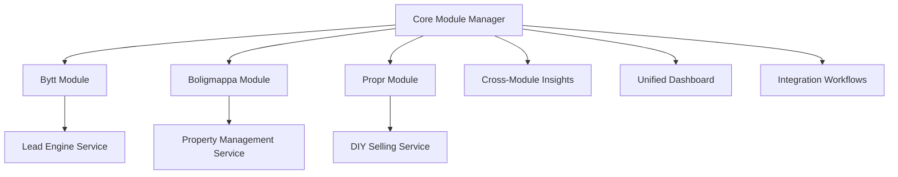
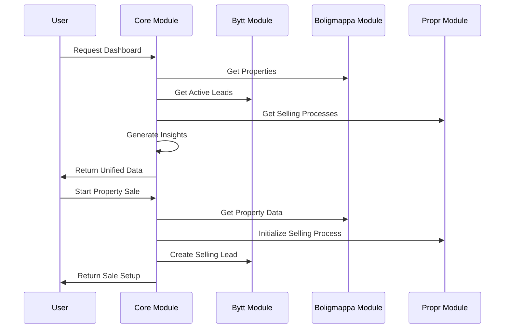

# Core Module - Unified Platform Orchestration

The Core Module serves as the central orchestration layer for the Homni platform, integrating the three main business modules:

- **Bytt.no** (Lead Generation & Comparison)
- **Boligmappa.no** (Property Documentation & Maintenance) 
- **Propr.no** (DIY Property Selling)

## Architecture Overview



## Key Components

### 1. ModuleManager (`ModuleManager.ts`)

Central orchestration service that:
- Initializes user journeys across all modules
- Generates cross-module insights and recommendations
- Manages property-to-sale workflows
- Handles lead-to-property conversions
- Provides unified dashboard data

### 2. UnifiedDashboard (`UnifiedDashboard.tsx`)

Cross-module dashboard providing:
- Consolidated metrics from all modules
- Smart insights based on user data
- Recent activity feed
- Personalized recommendations
- Tabbed interface for different views

### 3. ModuleIntegrationHub (`ModuleIntegrationHub.tsx`)

Workflow management interface offering:
- Available integration workflows
- Category-based workflow organization
- Complexity-based filtering
- One-click workflow execution
- Progress tracking

## Integration Workflows

### Property-to-Sale Integration
```typescript
// Convert documented property to DIY sale process
const saleData = await moduleManager.initiatePropertySale(propertyId);
// Returns: selling process, market analysis, costs, documentation score
```

### Lead-to-Property Integration  
```typescript
// Convert property lead to full property documentation
const property = await moduleManager.convertLeadToProperty(leadId);
// Creates property record and updates lead status
```

### Market Analysis Integration
```typescript
// Generate comprehensive market insights
const insights = await moduleManager.generateCrossModuleInsights(userId);
// Returns: market opportunities, maintenance alerts, selling readiness
```

## Cross-Module Insights

The system automatically generates insights by analyzing data across modules:

1. **Market Opportunities**: Property value vs market estimates
2. **Maintenance Alerts**: Overdue maintenance affecting sale value  
3. **Selling Readiness**: Documentation completeness for DIY sales
4. **Cost Optimization**: DIY vs agent selling comparisons

## Data Flow



## API Integration

### Cross-Module Data Access
```typescript
interface UnifiedUserProfile {
  user_id: string;
  properties: Property[];
  active_leads: Lead[];
  selling_processes: SellingProcess[];
  preferences: UserPreferences;
}
```

### Workflow Execution
```typescript
interface IntegrationWorkflow {
  id: string;
  title: string;
  description: string;
  modules: string[];
  complexity: 'simple' | 'intermediate' | 'advanced';
  estimated_time: string;
  potential_value: string;
}
```

## Performance Considerations

- **Lazy Loading**: All components are lazy loaded for optimal performance
- **Data Caching**: Cross-module data is cached to minimize API calls  
- **Batch Operations**: Multiple database operations are batched where possible
- **Progressive Loading**: Dashboard loads incrementally for better UX

## Testing Strategy

### Unit Tests
- Individual service method testing
- Mock integration with Supabase
- Error handling scenarios
- Data transformation logic

### Integration Tests  
- Cross-module workflow testing
- End-to-end user journeys
- Performance benchmarks
- Error recovery testing

### Component Tests
- Dashboard rendering with various data states
- Workflow execution flows
- User interaction handling
- Accessibility compliance

## Development Guidelines

### Adding New Workflows

1. Define workflow in `ModuleIntegrationHub`
2. Implement logic in `ModuleManager`  
3. Add corresponding tests
4. Update documentation

### Cross-Module Data Access

1. Use `ModuleManager` for all cross-module operations
2. Maintain data consistency with proper error handling
3. Cache frequently accessed data
4. Log all cross-module interactions

### Error Handling

1. Graceful degradation when modules are unavailable
2. User-friendly error messages
3. Automatic retry for transient failures
4. Comprehensive logging for debugging

## Security Considerations

- **RLS Policies**: All data access respects row-level security
- **User Isolation**: Cross-module data is filtered by user access
- **API Authorization**: Module interactions verify user permissions
- **Data Validation**: All cross-module data transfers are validated

## Future Enhancements

1. **AI-Powered Insights**: Machine learning for predictive recommendations
2. **Real-time Sync**: Live updates across module boundaries  
3. **Advanced Analytics**: Comprehensive business intelligence dashboards
4. **Mobile Optimization**: PWA features for mobile workflows
5. **Third-party Integrations**: External service connections

## Troubleshooting

### Common Issues

1. **Missing Cross-Module Data**: Check RLS policies and user permissions
2. **Slow Dashboard Loading**: Verify data caching and query optimization
3. **Workflow Failures**: Check service availability and error logs
4. **Inconsistent States**: Verify transaction handling and rollback logic

### Debug Tools

- Enable debug logging with `DEBUG=core-module`
- Use browser dev tools for performance monitoring
- Check Supabase logs for database issues
- Monitor network requests for API failures

## Contributing

When working on the Core Module:

1. Follow the established patterns for cross-module integration
2. Maintain comprehensive test coverage (>90%)
3. Update documentation for any new workflows
4. Consider performance impact of new features
5. Ensure accessibility compliance for UI components